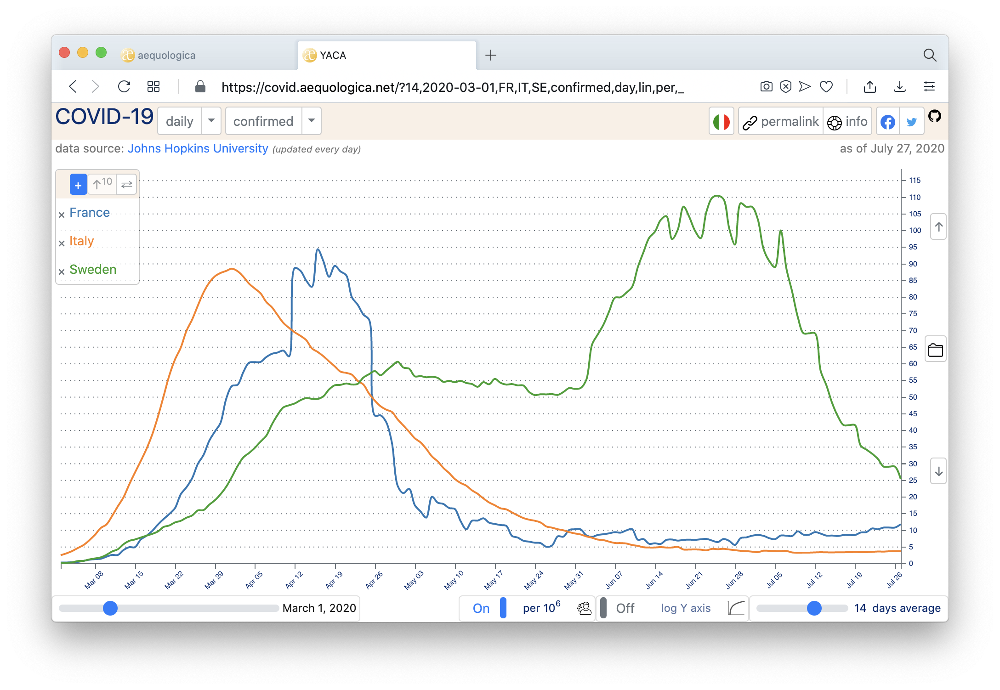

# YACA - Yet Another Covid-19 App

Live at [covid.aequologica.net](http://covid.aequologica.net/). Consuming [Johns Hopkins University](https://coronavirus.jhu.edu/data/new-cases) data through [pomber/covid19](https://github.com/pomber/covid19).

## What is it about ?

You are involved in a heated discussion on your favorite Whatsapp group about the confinement measures. 
One guy - who happens to be your best friend - maintains that Sweden is doing pretty good notwithstanding it did not implement confinement. 
You do not want to terminate a 20 years long friendship, so, instead of calling him names, you cut & paste the following permalink in the Whatsapp chat :

```
https://covid.aequologica.net/?day,confirmed,FR,IT,SE,2020-03-01,per,lin,18,_
```

This will lead to a web page that shows a comparison graph of all daily (**day**) **confirmed** new cases for France (**FR**), Italy (**IT**) and Sweden (**SE**), 
starting from the 1st of March of this year (**2020-03-01**), until the latest available data from the [Johns Hopkins University](https://github.com/pomber/covid19); 
the population of Sweden is roughly 1/6 of France or Italy, so the figures are per capita (**per**), to adjust for that; 
the Y-axis scale is linear (**lin**); were it logaritmic (log), the differences between the countries would be attenuated, although comparison between 
coutries with very different low and high numbers would be easied (try to add South Korea (KR) to the URL, then switch between logaritmic and linear Y axis : you will understand what I mean); 
finally, to reduce the noise inherent with daily figures, for each day a moving average of the previous **18** days is plotted.


Try it here: [https://covid.aequologica.net/?day,confirmed,FR,IT,SE,2020-03-01,per,lin,18,_](https://covid.aequologica.net/?day,confirmed,FR,IT,SE,2020-03-01,per,lin,18,_)



## All this typing ?

You may find cumbersome all this typing (read: you are not a geek). But wait, you can configure all these options with the - hopefully - intuitive user interface of the application, and boom! one click on the "permalink" button at the top right of the screen will generate the well-formed link with all information and have it copied to the clipboard. Now, you may go back to Whatsapp, paste the link, and resume the conversation.


## Complete Reference Guide

There are 6 categories. For each category, valid values are (defaults are in **bold**):

1. confirmed / **deaths** / recovered,
2. **day** or **daily** / tot or total,
3. log or logarithmic / **lin** or **linear**,
4. per or percapita / **abs** or **absolute**,
5. any number between 1 and **21** incl. will set the size of the average,
6. start date in YYYY-MM-DD format; default is January 21, 2020, i.e. **2020-01-21** (before, there is no data).

Categories must be separated by comma. Otherwise, parsing is rather lenient :

- each and every category is optional; when omitted, default value will apply (in **bold** above),
- categories may appear in the query string in any order,
- white spaces will be trimmed,
- case does not matter; FR, fr, Fr and fR will all go to France,
- if several options appear for the same category in the URL, the **first** one wins: e.g. 
```
https://covid.aequologica.net/?daily,confirmed,deaths,2,3,4,5,6,7,8,9,_
```
displays the daily confirmed cases with a 2 days average (try it: [first one wins](https://covid.aequologica.net/?daily,confirmed,deaths,2,3,4,5,6,7,8,9,_)).

Countries are specified with their associated [ISO-3166-1 alpha-2](https://github.com/lukes/ISO-3166-Countries-with-Regional-Codes) code, cf. [this wikipedia page](https://en.wikipedia.org/wiki/ISO_3166-1#Officially_assigned_code_elements). If no country is specified, the list of countries per default is [here](https://github.com/cthiebaud/cthiebaud.github.io/blob/master/js/model/factory.js); A country code suffixed with an asterisk marks that country as 'selected'. There can be only one selected country. If more than one is present in the permalink, the **first** one wins.

### Examples

|  description       |   URL         | 
| ------------- |:-------------:| 
| all defaults     | https://covid.aequologica.net |
| the seven largest countries      | https://covid.aequologica.net/?BR,CN,IN,ID,NG,PK,US,_      | 
| total confirmed cases in Brazil, Russia and USA since the 11th of March, linear scale, per capita numbers and 14 days average | https://covid.aequologica.net/?confirmed,tot,lin,per,14,2020-03-11,BR,RU,US,_      | 
| comparison of the 4 scandinavian countries (Denmark, Finland, Norway, Sweden) | http://covid.aequologica.net/?DK,FI,NO,SE,_ |

_Tip : ending the query string with an underscore (\_) prevents Facebook to horribly mangle the URL when pasted into a post. It has no use other than this; the underscore must be separated from the option before by a comma._

## New features

### Select country

Notice the * in the permalink:

```
https://covid.aequologica.net/?14,2020-03-01,FR,IT*,SE,confirmed,day,log,per,_
```

Observe the results in the screenshot below.

Clicking country name in the legend toggles the selection.

Selected country, if any, is locally stored.


### Reset

The &hellip;

1. _measure_ (confirmed/deaths/recovered),
2. _daily or not_
3. _linear or logaritmic_
4. _per capita or absolute_
5. _size of the average_,
6. _start date_, and 
7. _selected country_

&hellip; categories are stored locally (using [localStorage API](https://developer.mozilla.org/en-US/docs/Web/API/Window/localStorage)).

If there is no local storage in the browser (e.g. when cookies are blocked), nothing is stored; refresh the page will restore all default values.

All stored values can be erased with the 'reset' query string :

```
https://covid.aequologica.net/?reset
```

Try it: [reset!](https://covid.aequologica.net/?reset)

### Store permalink config

When accessing the site through a permalink, the categories defined in the permalink are not stored locally; hence, reloading the page from the classic (without query string) [url](https://covid.aequologice.net) will restore the 
previous stored categories, forgetting anything that was setup in the permalink.

Nevertheless, it is possible to make persistent the permalink by adding a **!** character:

```
https://covid.aequologica.net/?1,2020-02-25,US,VA,confirmed,log,per,tot,!
```

Try it : [store US vs. VA permalink!](https://covid.aequologica.net/?1,2020-02-25,US,VA,confirmed,log,per,tot,!)

### Location detection

YACA will try to detect your location; If successful, a country button will appear top right. If there is no country button, probably the detection failed. Clicking on this button will redirect to the graph for this particular country.

### Easier selection with country picker

Adding or removing countries from the list with the country picker modal dialog is easier with keyboard [enter] key. Click on or select text of a country name, then press enter, the selection will be toggled Be aware that, depending on the sort criteria of the table, the country may be pushed at the top or bottom of the list, hence vanishing from sight.


## Some analytics

That's the map from [Google Analytics](https://analytics.google.com/analytics/web/#/) about the frequentation of the site, as of 18th of June 2020, since its creation, the 17 of April 2020.


